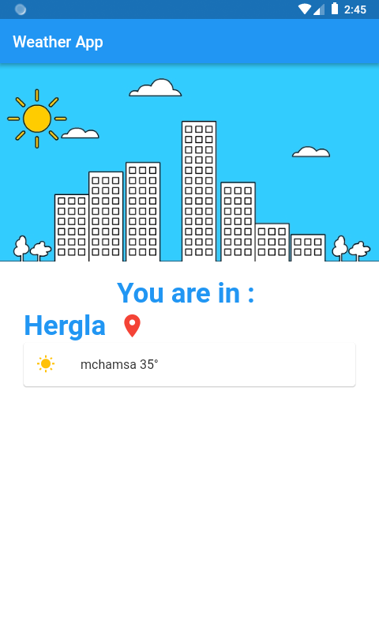
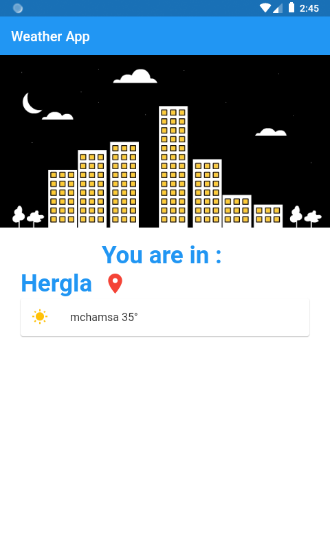
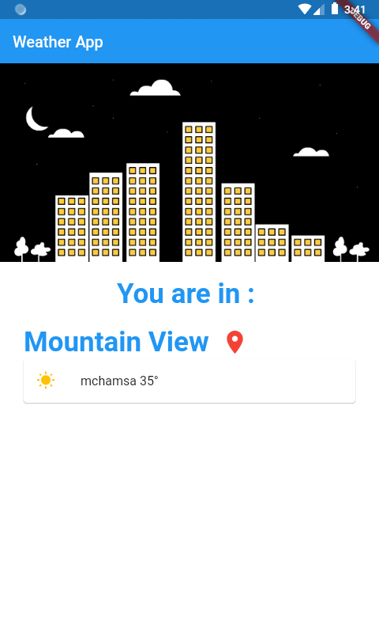

# secondweatherapp

A second Flutter Weather application.

## Getting Started

This project is a starting point for a Flutter application.

A few resources to get you started if this is your first Flutter project:

- [Lab: Write your first Flutter app](https://flutter.dev/docs/get-started/codelab)
- [Cookbook: Useful Flutter samples](https://flutter.dev/docs/cookbook)

For help getting started with Flutter, view our
[online documentation](https://flutter.dev/docs), which offers tutorials,
samples, guidance on mobile development, and a full API reference.

- intl package :

    * https://pub.dev/packages/intl

- Add the function displayImage() to display the image when it's day or night

<table>
    <tr>
        <td style="padding:10px">
            
        </td>
        <td style="padding:10px">
            
        </td>
    </tr>
</table>

- geolocator package :

    * geolocator: ^5.3.2+2

- Add the Permission to the Android and iOS project :

    * Android (AndroidManifest.xml):
        <uses-permission android:name="android.permission.ACCESS_FINE_LOCATION" />
        <uses-permission android:name="android.permission.ACCESS_COARSE_LOCATION" />

    * iOS (Info.plist):
        <key>NSLocationWhenInUseUsageDescription</key>
        <string>This app needs access to location when open.</string>
        <key>NSLocationAlwaysUsageDescription</key>
        <string>This app needs access to location when in the background.</string>
        <key>NSLocationAlwaysAndWhenInUseUsageDescription</key>
        <string>This app needs access to location when open and in the background.</string>

- Get The Current Location using :

    * Geolocator().getLastKnownPosition

- Get The City Name using :

    * Geolocator().placemarkFromCoordinates

    